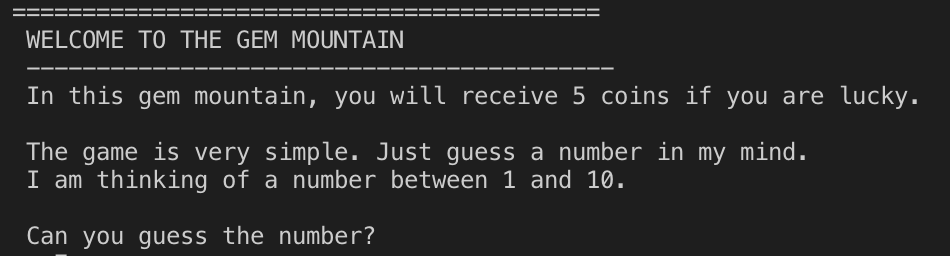
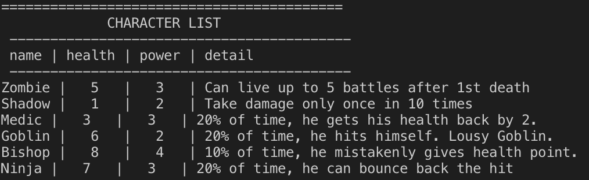
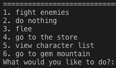
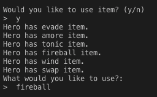
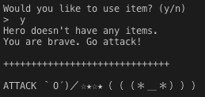
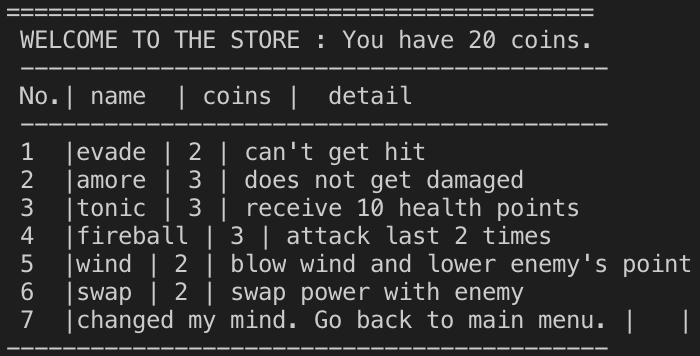
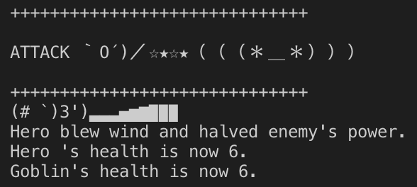

# RPG GAME - COMMAND LINE
This is a terminal based RPG Game programed in Python 3. I made this game in Week 2 of DigitalCrafts. The main purpose of this project is to learn Object Oriented Programming. 

## Characters
<b>Hero's detail</b>

<b>Enemies</b>

## Actions
Here is the list of actions that the player can take.

1. fight enemies
You can fight enemies. 
The game will ask you whether you would like to use items.

If you don't have items, the game will continue playing.

2. do nothing
The enemy will attack you.

3. flee
This will end the game.

4. go to the store.
You can purchase items to attack enemies.

5. view character list
This will show list of enemies which is listed above on Characters.

6. go to gem mountain
You can play "Guess a number" game to earn 5 points if you are lucky :)

## How to play:
1. If you don't have python3 (If you have Python3, skip this.)
download python 3 for your OS.
https://www.python.org/downloads/

Make sure your dependencies are all there.

2. Clone this repo to your local machine.
https://github.com/hirosoft40/RPGgame.git

3. Open Terminal and play!

## Language
<ul><li> Python3 </li></ul>

## Features
I have implemented few things so that a game beginner like myself can enjoy also.
<ol>
<h3><li> Gem Mountain</li></h3>

Users mind changes. Sometimes they want to play games, sometimes they are tired of attacking. So, I have created gem Mountain to play a very simple game. 

<h3><li> Anime style emotions </li></h3>

I have added Anime style emotions so that users can enjoy more without reading letters.

<h3><li> Error Handlings </li></h3>

This game prompt user inputs. Therefore I spent more time on coding error handling.

</ol>

## My Challenge
I am not a game person. So my biggest challenge was to learn more about how RPG game works. I interviewed few family members and then I was able to come up with specifications.
