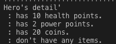

# RPG GAME - COMMAND LINE
This is a terminal based RPG Game programed in Python 3. I made this game in Week 2 of DigitalCrafts. The main purpose of this project is to learn Object Oriented Programming. 

## Characters
<h4>Hero's detail</h4>

<h4>Enemies</h4>

## Actions
Here is the list of actions that the player can take.

<li>
<li> fight enemies</li>

You can fight enemies. 
The game will ask you whether you would like to use items.

If you don't have items, the game will continue playing.

<li>do nothing</li>

The enemy will attack you.

<li>flee</li>

This will end the game.

<li>go to the store.</li>

You can purchase items to attack enemies.

<li> view character list</li>

This will show list of enemies which is listed above on Characters.

<li>go to gem mountain</li>

You can play "Guess a number" game to earn 5 points if you are lucky :)

## How to play
<ol>
<li>If you don't have python3 (If you have Python3, skip this.)
download python 3 for your OS.</li>
https://www.python.org/downloads/

Make sure your dependencies are all there

<li>Clone this repo to your local machine.</li>
https://github.com/hirosoft40/RPGgame.git

<li>Open Terminal and play!</li>
</ol>

## Language
<ul><li> Python3 </li></ul>

## Features
I have implemented few things so that a game beginner like myself can enjoy also.
<ol>
<h3><li> Gem Mountain</li></h3>

Users mind changes. Sometimes they want to play games, sometimes they are tired of attacking. So, I have created gem Mountain to play a very simple game. 

<h3><li> Anime style emotions </li></h3>

I have added Anime style emotions so that users can enjoy more without reading letters.

<h3><li> Error Handlings </li></h3>

This game prompt user inputs. Therefore I spent more time on coding error handling.

</ol>

## My Challenge
I am not a game person. So my biggest challenge was to learn more about how RPG game works. I interviewed few family members and then I was able to come up with specifications.
